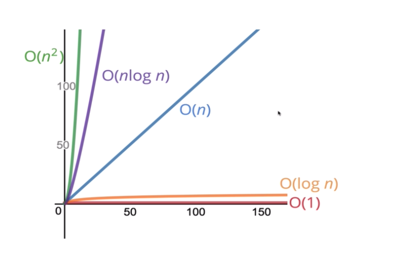

# BigO

A notation to formalise the efficiency of code (how much time does it take and how much space does it take in memory). It's a general way of counting these values, because you'll see we're not really interested in exact details, simply broad trends.

We are generally talking about **how the time and space increase as inputs to our algorithms increase.** Or put a different way, it describes the relationship between the input and the time it takes to run, and how one changes when the other changes.

### Time complexity

When we're talking about time specifically there are a few common relationships (there are more than these though!)

| Relationship                  | Description                                                                                                                                                                                                                                                                                 |
| ----------------------------- | ------------------------------------------------------------------------------------------------------------------------------------------------------------------------------------------------------------------------------------------------------------------------------------------- |
| Constant time $$f(n) = 1$$    | As the size of the input grows, time doesn't change at all. It remains constant regardless of how large the input is.                                                                                                                                                                       |
| Linear time $$f(n) = n$$      | As the size of the input grow, time increases at the same rate. They have a linear relationship, and the increase ration remains the same. If you're thinking about it in terms of line graphs, the gradient remains constant.                                                              |
| Log time $$f(n) = log n$$     | As the size of the input grows, time increases following a logarithmic relationship (a curve that gradually flattens off). You'll see examples of this as you learn more about the different algorithms, but see below for a graph to show you the relationship.                            |
| Quadratic time $$f(n) = n^2$$ | As the size of the input grows, the time increases following a quadratic relationship. This is generally considered a bad thing! For example if you increase the size of the input by 5, the time increases by 25. You'll see this often when using nested loops so keep an eye out for it! |

### Simplifying BigO calculations

Here are few examples of how we might calculate the BigO of a function or algorithm, and how we only really care about general trends.

This first function just takes an input number and will print "Hello!" that many times and then print "Bye!" that many times.

```javascript
//JavaScript

function sayHelloSayBye(n){
    for (let i = 0; i < n; i++){ // this for loop is O(n)
        console.log("Hello!")
    }
    
    for (let i = 0; i < n; i++){ //this for loop is O(n)
        console.log("Bye")
    }
}
```

For each loop, as the size of the input number increases, so does the number of times the for loop executes, so they have a linear relationship.&#x20;

Now because there are two for loops we add them together to O(2n) but we actually don't care about constants, but rather just what the general relationship is like, so O(n).

This next example is a little different. It will take an input number, and print all integer pairs between zero and n. Note the nested for loops:

```javascript
//JavaScript

function printAllPairs(n){{
    for (let i = 0; i < n; i++){ // O(n)
        for (let j = 0; j < n; j++){ // nested O(n)
            console.log(i, j)
        }
    }
}
```

So here we would multiply them together $$O(n * n)$$ or basically $$O(n^2)$$

Just a quick note that using loops doesn't automatically mean O(n), just always ask yourself "what happens as n increases?" Take the following example:

```javascript
//JavaScript

function atMostTen(n){
    for (let i = 0; i < Math.min(10, n); i++) {
        console.log(i)
    }
}
```

In this example, the function takes a number and will print starting from 0 up to either 10 or n, whichever is smallest. However we care about what happens as n grows. If n is smaller than 10 that will obviously change the number of operations, but as n get's larger and larger it doesn't actually have any effect on the number of operations because it'll only ever run at most 10 times. So the BigO of this is $$O(1)$$ constant time.

#### Small terms don't matter

If you are adding up all the BigO operations in a function you have written, we only really care about the largest term. So say for example you collected all the BigO terms and ended up with

$$O(3n^2 + 5n)$$ we would only care about the largest n squared term $$O(n^2)$$ so we would say that this particular function ran in quadratic time, because over a large enough input size that's the term that would matter.

### Appendix

Here's a quick "at a glance" comparison of some relationships, and at the least you'd want to be able to say which might be better than another.&#x20;



Below is an example of a log x graph for those who haven't seen one or studied maths before.


Log graph example

