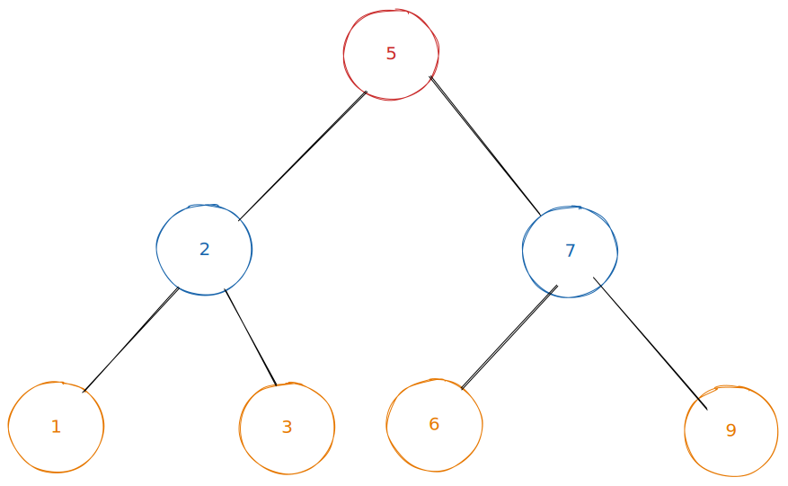

# Merge Sort

Some things to wrap your head around when visualising merge sort:

* Merging together two sorted arrays is relatively easy, and will be used as part of the algorithm.
* It will make use of splitting an array in half again and again until we reach an array of 1 item (guaranteed to be sorted!)

**In English:**\
\- Say we have an array\
\[2, 1, 11, 7]\
\- split that into two arrays\
\[2, 1]    \[11, 7]\
\- split each of those into two arrays, which leaves us with 4 sorted arrays (single item arrays are sorted by default!)\
\[2] \[1]    \[11] \[7]\
\- Then we merge them back together (because now they're sorted arrays)\
\[1, 2]     \[7, 11]\
\- And again\
\[1, 2, 7, 11]\
\- And there we go!

For this algorithm we'll make a helper function that has the single responsibility of merging two sorted arrays.

The rest of the algorithm (splitting the arrays up into halves) will be done recursively, which can be a little hard to wrap your head around at first. Here's the function to help us merge two arrays:\


```go
//Go

//Merge helper function which merges two SORTED lists of data
func merge(arr1 []int, arr2 []int) []int {
    res, i, j := make([]int, 0), 0, 0
    
    for i < len(arr1) && j < len(arr2) {
        if arr1[i] < arr2[j] {
            res = append(res, arr1[i])
            i++
        } else {
            res = append(res, arr2[j])
            j++
    }

    //if any items left over append them to the result slice
    for i < len(arr1) {
        res = append(res, arr1[i])
        i++
    }
    
    for j < len(arr2) {
        res = append(res, arr2[j])
        j++
    }
    
    return res
} 
```

```go
//Go

//using the merge helper function above

func MergeSort(arr []int) []int {
    if len(arr) <= 1 {
        return arr
    }
    mid := len(arr) / 2
    left := MergeSort(arr[:mid])
    right := MergeSort(arr[mid:])
    
    return merge(left, right)
    
}
```

I feel like that hardest bit to grasp about this algorithm is the recursive nature of it. It usually helps to visualise the call stack, but what is essentially happening is we call MergeSort and pass it an array, split the array into a left and right half, then it calls itself passing in each half. Which will happen again, and again and again until each half is only 1 element.

When the **left**  variable and the **right** variable both receive a single element, MergeSort calls the merge function and returns the result (which will be used as the left or right variable for the previous call) and so on back to the original call which will finally call merge and return the result.&#x20;



