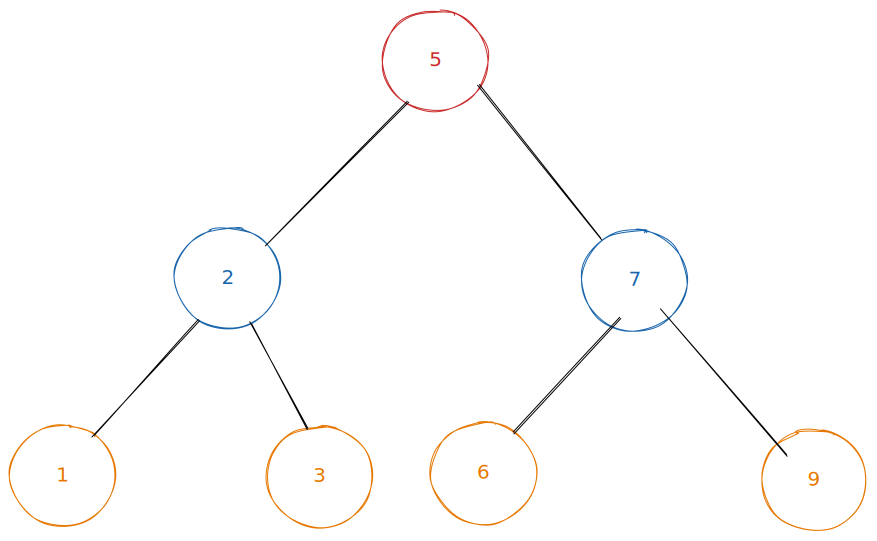

# Radix Sort

In English:\
The general idea is that we look at numbers in terms of 1s, 10s, 100s, 1000s etc like so:\
\
take the number: <mark style="color:red;">356</mark>, <mark style="color:blue;">23</mark>, <mark style="color:green;">4119</mark>

| 1000s                               | 100s                                | 10s                                 | 1s                                  |
| ----------------------------------- | ----------------------------------- | ----------------------------------- | ----------------------------------- |
| 0                                   | <mark style="color:red;">3</mark>   | <mark style="color:red;">5</mark>   | <mark style="color:red;">6</mark>   |
| 0                                   | 0                                   | <mark style="color:blue;">2</mark>  | <mark style="color:blue;">3</mark>  |
| <mark style="color:green;">4</mark> | <mark style="color:green;">1</mark> | <mark style="color:green;">1</mark> | <mark style="color:green;">9</mark> |

The first time we loop though the list looking at the 1s, and we sort them into 'buckets' based on the numbers in that position. Then we put them back into a list format in order of buckets



(Ignore the fact that this 3-item list is already sorted haha) We then look at the digit in the 10s column and repeat the process. And we repeat this process based on the length of the longest digit (in this case 4 times, because 4119 has 4 digits).

We are not comparing any two numbers, just taking them from a list, putting them in a particular order, then putting them back into a list.

```typescript
//TypeScript

//Helper function to get the digit at a certain point in a number
function getDigit(num: number, i: number): number {
  return Math.floor(Math.abs(num) / Math.pow(10, i)) % 10;
}


//Helper function to count the number of digits in a number ie 4119 -> 4
function digitCount(num: number): number {
  return num.toString().match(/\d/g)!.length;
}
```

```typescript
//TypeScript

function radixSort(arr: number[]): number[] {
  let max = digitCount(Math.max(...arr));

  for (let i = 0; i < max; i++) {
    let buckets: number[][] = Array.from({ length: 10 }, () => []);
    for (let j = 0; j < arr.length; j++) {
      let digit = getDigit(arr[j], i);
      buckets[digit].push(arr[j]);
    }

    arr = [];
    for (let bucket of buckets) {
      arr = [...arr, ...bucket];
    }
  }

  return arr;
}
```
